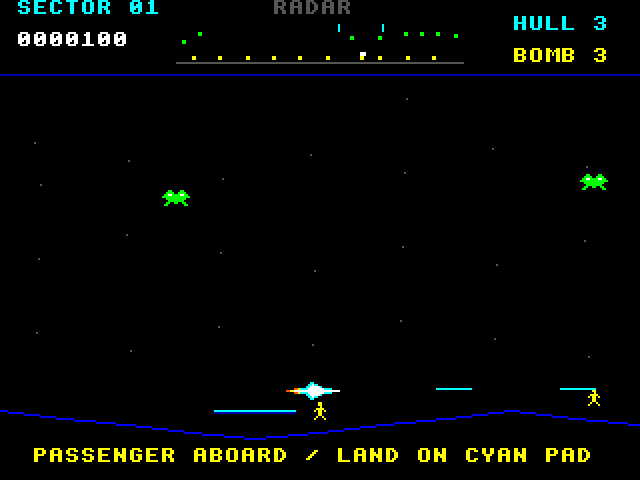
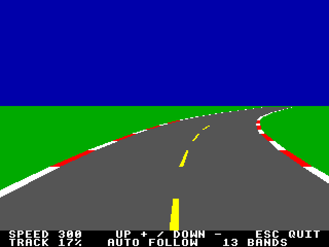

# AgonArcade

A collection of native arcade games for Agon, with original pixel art and synthesized sound.

## Defender

[Agon Defender](defender/README.md) features inertial flight, a wraparound planet,
lasers, smart bombs, alien abductions, and civilian rescues.



```sh
make -C defender
.venv/bin/python defender/tools/prepare_emulator.py
./defender/run.sh
```

Arrow keys fly, Space fires, and X uses a smart bomb. Pick up people and slow
down over a cyan pad to deliver them. Enter starts, P pauses, M toggles sound,
and Escape returns to MOS.

Builds use installed agondev and the stock Agon VDP. Each game owns its emulator
profile; local environments, emulator state and build output are ignored.

```sh
make -C defender test
```

The local checkout lives at `~/Agon/mystuff/AgonDefender`; the repository is named
**AgonArcade**. Future games belong in sibling subdirectories beside `defender/`.
Pynvaders and Aginvadors remain in their separate repository.

## Agon Rally prototype

The [flat-road prototype](rally/README.md) lives in `rally/`: gray asphalt,
red/white kerbs and yellow dashed markings, now following a looping track traced
from the supplied arcade map. Up accelerates, Down brakes, and Escape returns
to MOS. Left/Right steer the player car, with lateral inertia and a grass slowdown.
The new driving build awaits human review; the earlier road-only milestone
passed on hardware.



Build with `make -C rally`, then launch `./rally/run.sh` after preparing its
isolated emulator profile as described in its README. The
[detailed research](docs/research/pole-position/README.md) covers original arcade
hardware, projection, command budgets and supporting sources; the
[earlier proposal](docs/plans/rally-flat-road.md) records the broader design.
