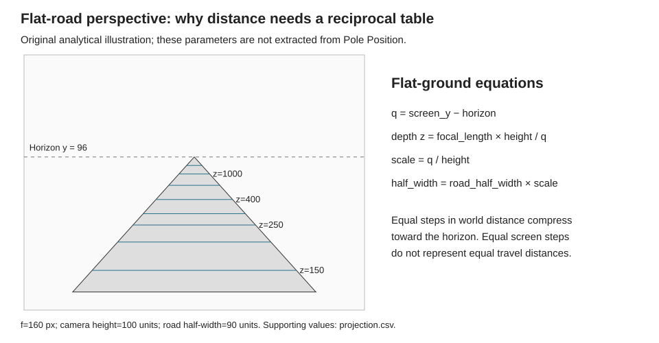

# Pole Position road rendering and a flat-road engine for Agon

The useful lesson from Pole Position is to describe the road compactly and let
the display machinery expand that description. A convincing road does not
require a general 3D engine. For Agon, the recommended starting point is a
fixed-height camera, a precomputed screen-row-to-distance table, distance-based
road markings, and a modest number of filled road bands composed in mode 136.
This is a proposed original implementation, not an attempt to emulate the
arcade board or reproduce its ROM contents.

The first prototype should establish a stable flat road and believable forward
motion before adding curves. “Flat” means constant ground elevation; horizontal
bends can follow within that same foundation. Traffic, hills, racing rules and
finished artwork would obscure the initial questions and are outside this
prototype. The working title remains **Pole Position**; **Agon Rally** identifies
the planned project, and the eventual release name remains undecided.

The [review plan](../../plans/rally-flat-road.md) turns these findings into a
bounded implementation proposal. The [source register](sources.md) records
provenance, exact locations and limitations. Numerical assumptions and all
performance estimates are reproducible from [calculations.py](calculations.py).

## 1. Evidence and confidence

Three kinds of evidence need to stay separate. Atari's original schematics are
primary evidence for the shipped licensed board. MAME is primary evidence for
its own hardware reconstruction, not the original game program. Modern authors'
road-engine tutorials are primary evidence for their demonstrated techniques,
not proof that Namco used their particular equations.[^1][^2][^5][^6]

| Finding | Confidence and boundary |
| --- | --- |
| The arcade has dedicated road circuitry | High: original schematic blocks and reconstruction agree |
| Road appearance depends on scanline position and lookup data | High at the hardware-interface level |
| A software framebuffer XOR trick is the essential road mechanism | Unsupported by the inspected evidence |
| The original game used exactly the curve equations proposed below | Not established; these are our design choices |
| A row/depth table is suitable for an original flat-road engine | Strong mathematical basis; native performance remains to be measured |
| The proposed renderer reaches its target on physical Agon hardware | Unmeasured; the byte budget is a screening calculation |

The distinction matters because a persuasive explanation of pseudo-3D can
still be an inaccurate explanation of a particular arcade board. The design
should borrow the useful decomposition without inventing historical details.

## 2. What the original hardware establishes

### 2.1 Original board evidence

Atari SP-218 identifies separate vertical-position PROMs, position latches and
adders, playfield RAM, and roadway memory/adders. The vertical counter drives
three PROMs; their outputs combine with the road-position register before
addressing video memory. Horizontal-position circuitry modifies roadway
addresses. Object rendering separately uses a match circuit, a size-clock
rate generator, picture memory and line buffers. Final output circuitry selects
between picture streams and converts palette outputs to RGB. These are dedicated
raster-generation paths, rather than a CPU painting a complete pixel framebuffer.[^1]

The strongest pages are sheets 11B–12B for road addressing and sheets 14A–15B
for object sizing, buffering and output. Their printed sheet labels are more
reliable locators than the page count of an arbitrary combined PDF. The inspected
32-page scan maps those sheets to PDF pages 22–24 and 27–30.[^1]

### 2.2 Reconstruction evidence

MAME's pinned `draw_road` uses screen rows 128–255. It combines the vertical
modifier with RVP, shifts by three, and masks to nine bits to select a road-color
entry. A separate 128-entry area supplies 10-bit horizontal offsets. Road ROMs
supply starting values and increments, decoded in eight-pixel groups; low
horizontal bits provide fine alignment. This supports treating depth pattern
and lateral displacement as separate controls.[^2]

MAME also reconstructs 64 object descriptors with independent six-bit size
fields, a vertical lookup and horizontal accumulator. Its layer order is
background, road, objects, then text. The file explicitly describes parts of
object scaling as a reasonable approximation; it is not a transistor-level
proof of exact timing.[^2]

The driver configures one Z80 and two Z8002s at 3.072 MHz and a 256×224 visible
raster. Its timing constants imply approximately 60.606 Hz. It maps road RAM and
road vertical position separately from background horizontal scrolling. These
facts describe the arcade machine, not the Agon performance budget.[^3]

### 2.3 What that means for an original implementation

A useful engineering interpretation is to divide the view into three independently
controlled descriptions: lateral road shape, longitudinal surface pattern, and
objects attached to locations along the road. A screen row need not carry an
entire world simulation. It only needs the information required to draw the
cross-section that projects onto it.

A static road with moving distance bands already communicates travel. Changing
the cross-section centers communicates a bend. Moving the camera sideways
changes near and far positions by different amounts. Objects reinforce those
cues when they share the same coordinate system. These observations motivate
the proposed renderer; they do not establish the original program's internal
variables or track format.

The original program's curve integrator, steering transfer function and exact
PROM sample values have not been recovered here. No game ROMs were obtained or
executed. The preliminary patent search did not identify a verified original
road-generation patent, so later Namco racing patents are not used as evidence.

### 2.4 Was XOR responsible for the look?

The inspected material does not support framebuffer XOR plotting as the source
of Pole Position's road. XOR gates in a circuit, XOR used for address-bit
manipulation, and XOR applied to existing framebuffer pixels are different
operations. Finding the first or second does not establish the third.

For our design, XOR is unnecessary. Its reversibility only restores a previous
background if intervening changes and overlaps are handled correctly. A road
whose scenery, lane marks and objects all move is an awkward place to rely on
that property. Composing an opaque new back buffer is easier to reason about.
This is an engineering recommendation, not a claim that the original machine
contained no XOR logic anywhere.

### 2.5 The designers' account

Bandai Namco's interview with the creators emphasizes the work needed to make
acceleration, steering and braking feel convincing while simplifying the
simulation enough to be a game. It recalls development difficulties with driving
straight. The interview supports prioritizing control feel, but does not disclose
a road-rendering algorithm. Our first milestone should make a stationary or
straight-running road easy to inspect before introducing demanding handling.[^4]

## 3. Deriving the flat-road geometry

This section is our mathematical derivation. The similar-triangle basis is also
used in Jake Gordon's demonstrated road renderer. Louis Gorenfeld's treatment
explains the utility of a precomputed depth map and the visual problems caused
by inappropriate distance spacing.[^5][^6]



### 3.1 Coordinates and units

Use a camera above a level plane, looking horizontally along positive `z`.
Screen `y` increases downward. Let `h` be the horizon row, `H` camera height,
`f` focal length in pixels, `W` road half-width, and `Cx` the screen center.
World distances share one arbitrary unit; they are not meters until a game
chooses a physical scale. Screen positions are pixels. Keeping that distinction
explicit prevents accidental multiplication of pixels by pixels.

For a point on the road at distance `z > 0`, similar triangles give:

```text
q       = screen_y - h
q       = f H / z
z       = f H / q
scale   = f / z = q / H
halfwidth(screen_y) = W scale
```

For a straight road and lateral camera displacement `Xcam`:

```text
center(screen_y) = Cx - Xcam scale
left             = center - halfwidth
right            = center + halfwidth
```

Road width is linear in `q`, while distance is reciprocal. Those two facts are
compatible: the ground plane narrows linearly in the image, but equal lengths
of asphalt become increasingly compressed toward the horizon.

### 3.2 A concrete starting calibration

The following values are illustrative tuning inputs, not recovered arcade data:
`320×240`, `h=96`, `f=160`, `H=100`, `W=90`, with road sampling through row 223.
The last 16 rows can be reserved for a small diagnostic strip. Rows 97–223 give
127 useful ground samples. A nominal far cutoff of 2,000 world units starts
resolved detail at row 104; the few rows above it become a simple distant band.

| Screen row | Distance below horizon | Depth | Road half-width |
| --- | ---: | ---: | ---: |
| 104 | 8 | 2,000 | 7.2 px |
| 112 | 16 | 1,000 | 14.4 px |
| 128 | 32 | 500 | 28.8 px |
| 160 | 64 | 250 | 57.6 px |
| 208 | 112 | 142.857 | 100.8 px |
| 223 | 127 | 125.984 | 114.3 px |

A camera displacement of +25 units shifts the center left by two pixels at
row 104 and by 31.75 pixels at row 223. That is the parallax expected when moving
to the right of the road center. Translating the entire picture by one constant
pixel offset would not produce the same geometry.

The complete table is [projection.csv](projection.csv). Its generator verifies
monotonic depth, increasing apparent width and the forward/inverse projection
identity. These are analytical checks; they do not benchmark native rendering.

### 3.3 Forward motion and markings

Maintain traveled distance `s`, updated by `s += speed × elapsed_time`. For each
sample, derive the road material from world distance `s + z`. Alternating curb
colors can use `floor((s+z)/L) mod 2`, where `L` is a world-space band length.
Lane dashes use the same phase with separately chosen painted/gap lengths.
Advancing `s` moves every feature coherently toward the camera.

For a fixed road feature at world position `S`, its relative distance is
`z=S-s`. Its screen displacement is `q=fH/(S-s)`, and its speed toward the
bottom of the screen grows as `fH × speed / z²`. The feature therefore accelerates
visually as it approaches even when the car's world speed is constant.

Do not independently animate stripes by an arbitrary number of screen rows each
frame. That breaks their connection to roadside objects and produces visible
sliding. Do not quantize `s` to whole road segments; retain the fractional phase
so motion remains smooth across segment boundaries.

Near the horizon, one pixel can cover multiple whole stripes. Point-sampling a
binary pattern there produces flicker and apparent reverse motion. A first
prototype should stop drawing unresolved lane details in that region or blend
the distant appearance into a stable color. This is controlled loss of detail,
not an excuse to let the entire road pop as bands enter view.

### 3.4 Flat curves and steering

There are two different controls. Track curvature changes the centerline ahead;
steering changes the car's lateral relation to it. They should have separate
state variables and separate diagnostic modes. A road turning right should not
be implemented merely by translating the whole road right.

One proposed representation stores short constant-curvature intervals along
track distance. In a small-angle local approximation, let `theta` be road heading
relative to the camera tangent, `c` lateral center displacement, `k` curvature,
and `d` a world-distance step. Integrate with:

```text
c_next     = c + theta d + 0.5 k d²
theta_next = theta + k d
screen_center(z) = Cx + f (c(z) - Xcam) / z
```

The half-step term is needed if the stored `theta` is the heading at the start
of the interval. Track distance and integration step must remain independent of
how many visible bands the renderer chooses. Otherwise changing rendering
quality also changes the shape of the road.

This is a deliberately bounded approximation for gentle bends, not a solution
for arbitrary 3D track geometry. Start every view relative to the local track
tangent, retain the partial current interval, cap the far distance and test
straight/left/right/S transitions. If this approximation requires too much
special handling, a precomputed centerline sampled in camera-relative coordinates
is a reasonable alternative. The milestone should choose between those with
visible evidence, not accumulate both engines.

Gordon's demonstrated curve renderer uses accumulated offset and slope, and
compensates for fractional progress through the current segment. That is a useful
implementation comparison, but its particular artistic curve values are not
interchangeable with curvature expressed in world units.[^7]

Steering initially needs only bounded lateral motion and a stationary car marker.
A later arcade handling model can add speed dependence, outward drift, braking
and tire grip. It is much easier to tune those against an already stable road.

### 3.5 Objects, eventually

A roadside post and the road point beneath it should use the same relative `z`,
centerline displacement and scale. Anchor a bitmap by its bottom center so its
feet stay on the road plane. With fixed camera height, apparent height is
`object_height × scale`. A precomputed set of bitmap sizes can approximate
that scale without asking the CPU to resample art every frame.

Render distant objects before near ones, then the player's car and HUD. For the
first prototype, one or two original rectangular posts are enough to test scale
and attachment. Traffic behavior, collisions, explosions and polished cars are
not prerequisites for proving perspective.

## 4. Translating the idea to Agon

### 4.1 Rendering contract

Mode 136 supplies a 320×240 double-buffered display. Physical coordinates put
the origin at the top left. Screen swapping makes the composed back buffer
visible. Basic line, rectangle and triangle commands are sufficient for the
proposed road.[^8][^9]

The Defender work already exposed a local software-sprite/double-buffering
problem and settled on ordinary bitmap plots. Retain that choice here. The
initial Rally renderer should not activate VDP software sprites. Hardware sprites
are a separate, untested option and do not belong in the critical path.
The existing evidence is recorded in [Defender's platform notes](../../../defender/docs/platform.md).

Compose each back buffer completely: sky, distant ground/background, road and
curbs, markings, optional posts, car marker, then diagnostics. Clearing only the
currently visible display or retaining stale drawing state between alternating
buffers invites flicker and missing overlays. Use a full opaque composition
before optimizing dirty regions.

### 4.2 The serial budget changes the implementation choice

The inspected VDP configures its MOS link for 1,152,000 baud with 8N1 framing.
That permits at most 115,200 payload bytes per second before flow-control stalls.
Agondev's basic absolute PLOT commands carry six bytes, GCOL carries three,
and a buffer swap carries three. These are command counts, not measurements of
how fast the VDP completes the drawing.[^10][^11]

A colored horizontal span costs 15 bytes when sent as GCOL, MOVE and LINE.
Four spans on each of 128 rows cost 7,680 bytes. Adding an illustrative 300 bytes
for other commands gives 7,980 bytes: **69.27 ms of wire time alone**, or at most
14.44 such frames per second. A high clock rate on the host PC cannot remove
that physical link limit from the intended hardware design.

| Strategy | Example total bytes/frame | Minimum wire time | Link use at 25 fps |
| --- | ---: | ---: | ---: |
| 128 rows × four spans | 7,980 | 69.27 ms | 173.2% |
| 64 rectangular bands × four fills | 4,140 | 35.94 ms | 89.8% |
| 32 rectangular bands × four fills | 2,220 | 19.27 ms | 48.2% |
| 24 bands × four packed quadrilaterals | 2,892 | 25.10 ms | 62.8% |
| 32 bands × four packed quadrilaterals | 3,756 | 32.60 ms | 81.5% |
| Full 320×240 one-byte-per-pixel upload | 76,800 | 666.67 ms | 1,666.7% |

Four fills represent a road surface, two curbs and one center marking; grass is
an underlying fill. Extra lanes or independently striped grass cost more. Real
clipping and omitted distant markings can cost less. The 300-byte allowance is
an assumption to replace with instrumentation, not an assertion about final HUD
or artwork costs. See [wire-budget.csv](wire-budget.csv).

The packed-quadrilateral estimate uses GCOL followed by MOVE upper-left, MOVE
upper-right, filled TRIANGLE lower-left, and filled TRIANGLE lower-right. That
forms two triangles sharing the correct diagonal in 27 bytes. Calling the normal
three-point triangle helper twice would take 39 bytes including one GCOL. The
proposed packed sequence and seam behavior need verification in the native
benchmark before relying on the savings.

Wire time is a lower bound. CPU calculations, VDP interpretation, rasterization,
flow control and presentation can add costs or overlap. Do not add guessed
component timings and label the result an observed frame rate. Do not infer
physical ESP32 drawing throughput from a fast desktop renderer.

### 4.3 Recommended geometry/rendering split

Keep a one-row analytical description as the correctness reference. Convert that
geometry into a smaller set of visible bands for transmission. Band boundaries
should include visible curb/dash transitions; extra boundaries split bends where
linear edges would depart too far from the reference. Very distant detail can
be simplified when it is smaller than a pixel.

For a straight flat road, the edges are linear and a small number of trapezoids
can represent them exactly. Curbs and markings need additional boundaries where
their colors change. For a curved flat road, use the row reference to bound
screen-space error, initially aiming for no more than one pixel at road edges.
Measure whether the required band count fits the transport budget.

Start with an approximate 24-band budget and a 25 fps target, not a guarantee.
If visual error demands many more bands, the decision is to simplify distant
markings, lower frame rate, or use stored VDP commands. Silently changing speed
or road geometry to hide slow drawing would defeat the prototype's purpose.

### 4.4 Why not upload a fresh road bitmap?

A packed one-byte-per-pixel 320×128 road already needs 40,960 bytes. At the link
ceiling that is 355.56 ms per update, before headers or rendering. Uploading a
fresh raster each frame is therefore a poor baseline. Preloaded images and
ordinary bitmap draws are a different proposition: the image bytes remain on the
VDP and only short drawing commands cross the link.

Stored command buffers can similarly keep static sequences on the VDP. The
buffer API supports writing, calling and modifying command data.[^12] That may
help a measured bottleneck, but modifying many scattered coordinates also has
protocol overhead. “Buffered” does not automatically mean cheaper. Count update
bytes and VDP operations before adopting a self-modifying command-list design.

### 4.5 Arithmetic and instrumentation

Use fixed-point coordinates with explicit widths. The installed eZ80 environment
uses a 24-bit ordinary `int`; desktop test builds do not share that assumption.
Use explicit 32-bit intermediates where products need them, and define a
little-endian encoder that sends the two coordinate bytes expected by VDU. Do
not serialize a native C++ struct and hope its layout matches the command format.

Precompute depth and scale for the chosen camera. Retain fractional traveled
distance and lateral position. Avoid per-row floating-point divisions at runtime.
Choose fixed-point formats after bounding depth, curvature, width and products;
“Q16.16 everywhere” without range analysis is not a design.

A concrete candidate for the flat projection is depth in unsigned 32-bit Q24.8,
scale in unsigned 16-bit Q4.12, and projected half-width in unsigned 16-bit Q8.8.
Three separate 127-entry arrays then require 1,016 bytes. Here the notation counts
integer and fractional bits; signed lateral positions would use explicit signed
32-bit storage with eight fractional bits. These are proposed storage choices,
not a requirement to use the same format for every intermediate.

For a bounded example, limit visible relative center displacement to ±500 world
units and lateral camera offset to ±250. The largest lateral difference is then
750 units, or 192,000 in Q8. The maximum scale at row 223 rounds to 5,202 in Q12;
their product is 998,784,000, within signed 32-bit range. Shift that product by 20
fractional bits before converting to screen coordinates. Clip the resulting
coordinates before encoding VDU values. Curvature integration needs its own
bounds; a useful first restriction is a relative heading magnitude below
0.25 radians over the visible range. These bounds make the initial gentle-curve
approximation explicit rather than silently treating it as a general camera.

Measure emitted bytes/frame, CPU frame work, displayed frame cadence and input
responsiveness separately. Keep an explicit elapsed-time accumulator for
simulation so a rendering slowdown does not change the car's world speed.
Instrument both the ordinary and packed drawing paths with identical geometry.
At 60 Hz, a 25 fps target necessarily mixes display intervals; record that
cadence as well as average throughput, and evaluate a stable 30 fps mode if
measured headroom allows it. A stationary freeze mode and one-step phase advance
are more useful at this stage than a finished title screen.

Fab's inspected UART implementation models transmit cooldown and has receive
behavior intentionally different from the real machine. Its host VDP remains a
native desktop implementation. Emulator runs are valuable correctness evidence,
but hardware remains the authority for final performance and control latency.[^13]

## 5. Review conclusions and remaining uncertainty

The flat-plane mathematics is straightforward and gives a strong reference for
correctness. The practical uncertainty is how much road detail Agon's standard
VDP can draw at an acceptable cadence with the command budget available. The
first native experiment should resolve that before game systems are added.

The original circuit architecture is sufficiently understood to guide an
independent effect. Exact Namco program behavior, PROM values and analog pixel
timing remain unverified. No claim of bit-exact Pole Position reproduction is
made or needed. Likewise, the research does not establish any benchmark result
for an Agon Rally implementation; none exists yet.

The proposed sequence is a static flat road, distance-correct forward travel,
flat curves with stable transitions, and simple attached posts. Its acceptance
conditions and estimated budgets are in the [review plan](../../plans/rally-flat-road.md).
Only the root [TODO](../../../TODO.md) owns actionable work. The plan describes
the proposed shape of RALLY-01 and does not create a competing checklist.

## Sources

Full bibliographic notes, inspected locations, revision hashes, exclusions and
recovery instructions are in [sources.md](sources.md) and
[sources/manifest.json](sources/manifest.json).

[^1]: Atari, *Pole Position Schematic Package SP-218*, eighth printing, ©1982. [Original scan, sheets 11B–15B](https://files.stardustarcade.com/PDF_Arcade_Atari_Kee/Pole_Position/Pole_Position_SP-218_8th_Printing.pdf#page=22).
[^2]: MAME contributors, [`polepos_v.cpp`](https://github.com/mamedev/mame/blob/9fc40a6475d9d8d027f1df29db607627f65f5c04/src/mame/namco/polepos_v.cpp#L304), pinned reconstruction, BSD-3-Clause.
[^3]: MAME contributors, [`polepos.cpp`](https://github.com/mamedev/mame/blob/9fc40a6475d9d8d027f1df29db607627f65f5c04/src/mame/namco/polepos.cpp#L875), machine configuration and memory maps.
[^4]: Bandai Namco, [creator interview on the evolution of racing games, part one](https://www.bandainamcoent.co.jp/asobimotto/page/carracinggames1.html), April 25, 2019; Japanese-language first-person account.
[^5]: Louis Gorenfeld, [*Lou's Pseudo 3D Page*](https://www.extentofthejam.com/pseudo/), updated May 3, 2013; his explanation of road/depth-map techniques.
[^6]: Jake Gordon, [*How to build a racing game — straight roads*](https://jakesgordon.com/writing/javascript-racer-v1-straight/), 2012; projection and segmented-road implementation.
[^7]: Jake Gordon, [*How to build a racing game — curves*](https://jakesgordon.com/writing/javascript-racer-v2-curves/), 2012; offset/slope accumulation and segment continuity.
[^8]: AgonPlatform, [*Screen Modes*](https://github.com/AgonPlatform/agon-docs/blob/f9806bd3cbff6ed5d1c08bef1d51fed11764b86b/docs/vdp/Screen-Modes.md), inspected local revision.
[^9]: AgonPlatform, [*PLOT Commands*](https://github.com/AgonPlatform/agon-docs/blob/f9806bd3cbff6ed5d1c08bef1d51fed11764b86b/docs/vdp/PLOT-Commands.md), primitive semantics and paint modes.
[^10]: Fab 1.2.4 bundled VDP, [`agon.h`](https://github.com/tomm/agon-vdp/blob/7bcf28e0a2376e32328a6a5554d0df852b75c80e/video/agon.h) and [`vdp_protocol.h`](https://github.com/tomm/agon-vdp/blob/7bcf28e0a2376e32328a6a5554d0df852b75c80e/video/vdp_protocol.h), UART configuration; local paths and origin verification in source register.
[^11]: AgonPlatform agondev, [VDP library sources](https://github.com/AgonPlatform/agondev/tree/b67ab2444a63267a42193f204889d466765d8dd2/src/lib/libvdp), command encodings.
[^12]: AgonPlatform, [*Buffered Commands API*](https://github.com/AgonPlatform/agon-docs/blob/f9806bd3cbff6ed5d1c08bef1d51fed11764b86b/docs/vdp/Buffered-Commands-API.md), stored sequences and adjustment operations.
[^13]: Fab 1.2.4, [`agon-ez80-emulator/src/uart.rs`](https://github.com/tomm/fab-agon-emulator/blob/194a5e44c36a8bb886dae1741b01c6e7a1e5ede7/agon-ez80-emulator/src/uart.rs), cooldown and receive-path implementation.
