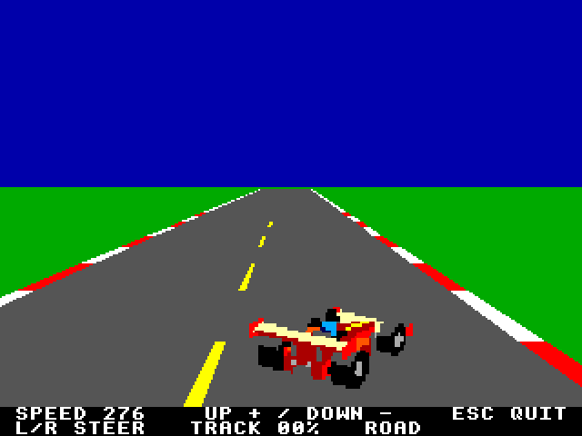
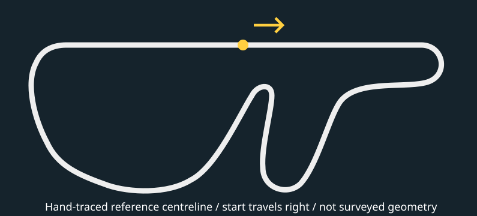

# Agon Rally — flat-track prototype



A native C++17 pseudo-3D road experiment: gray asphalt, red/white kerbs,
yellow dashed center line, white/yellow shoulder lines, doubled kerb width,
a solid blue sky and distant procedural scenery. It starts stationary on the front stretch of the compact flat tri-oval.
The earlier Fuji-reference circuit is also selectable.
Player speed is capped at 224 to limit the observed backwards-motion strobing.
Hold **Up** to accelerate or **Down** to brake to a stop. Releasing both holds
speed on the road. **Escape** returns to MOS. Hold **Left/Right** to change steering by three 256-circle angle units per rendered frame (21
each way; 1.40625° per unit). Releasing keeps the angle; holding the opposite direction returns
through center. Both held together leave it unchanged. The HUD shows the signed angle unit. Steering changes the car angle while
lateral motion retains inertia. The chase camera follows part of the lateral
movement; bends push the car outward. Kerbs slow the car moderately; grass slows it more strongly. Speed is in arbitrary world units/second, not km/h.
The HUD shows speed, steering angle and whether the car is on road, kerb or grass.

From the AgonArcade repository root:

```sh
make -C rally
make -C rally test
.venv/bin/python rally/tools/prepare_emulator.py
./rally/run.sh
```

On the Intel Mac, use the repository-root Python 3.13 environment. Without a
local `agondev-config`, `make -C rally` builds a source snapshot on the configured
SSH host `agon-linux`, runs its sanitizer tests, and downloads a checksum-verified
binary. Each build uses a fresh directory and preserves the Linux game checkout.
`make -C rally remote` selects this route explicitly; `make -C rally test` runs
host tests locally without the cross-compiler. The SSH alias and Linux toolchain
path are machine-specific settings in `tools/build_linux.py`.
Pillow and the local `agon-utils` checkout support the asset tools; ordinary
builds use the tracked generated headers. Blender 4.1.1 is installed on this Mac;
the migrated model was generated with 4.0.2 and has not been regenerated here.

Profile preparation defaults to `~/Agon/fab-agon-emulator` on macOS. Use
`--runtime /path/to/official/fab-checkout` to select another runtime explicitly.
The generated isolated `rally/.emulator` profile maps only `rally.bin` and writes
CRLF `autoexec.txt` commands to load and run it in default demo mode. The launch
script delegates to the canonical profile-local wrapper.

## Track source and geometry



Two circuits are embedded in the binary:

1. **Tri-oval** (default): an original, unbanked loop with a bowed front stretch,
   long back straight and matching tighter end turns. It runs counterclockwise in map
   coordinates. Lap length is 5,760 world units; this
   is a gameplay scale, not a measured Michigan/Daytona replica. The tightest analytical radius is about 367 units, twice Fuji's 183.
   Sampled-table minima are about 369 and 190 respectively.
2. **Fuji reference**: the previously accepted hand-traced arcade-map centreline,
   preserved byte-for-byte in its generated geometry CSV. It is not surveyed
   Fuji geometry or game-ROM data. Its lap remains 32,768 world units.

Editable cubics live in `assets/tracks/fuji.json` and `tri-oval.json`.
`make -C rally track` regenerates both tables, maps, CSVs and radius summaries.
Both use 64-unit arc spacing (512 Fuji samples, 90 tri-oval samples), with
interpolated position and tangent and continuous closing seams. Ground stays
level throughout; neither circuit introduces banking. Live grip tuning limits lateral tire acceleration against the bend demand
(`speed² / radius`) and steering demand.

After loading `rally.bin` in MOS:

```text
run                 # tri-oval
run . oval          # explicit tri-oval
run . fuji          # preserved Fuji circuit
```

See [track maps and geometry notes](assets/tracks/README.md).

For each screen row, find the track point at the corresponding distance ahead
and project its lateral displacement against the camera's local right vector.
Depth uses arc distance along the course. This is an arcade approximation, not
a general 3D camera: it preserves the established road-width/depth relationship
while introducing curves. It is not intended for crossing roads, hills or banked
surfaces. Forward progress and camera orientation follow the route tangent. Steering controls
a separate lateral offset with a bounded arcade slip model, not a free-world
vehicle heading simulation. This keeps the current road projection intact.

## Rendering and validation

Mode 136 (320×240) uses double buffering, filled primitives and no active software
sprites. MOS supplies 120 raw ticks per second in this mode (user confirmed).
The loop schedules submissions four ticks apart, nominally 30 per second before
workload delays. One legacy physics iteration still runs per elapsed tick;
its existing tuning and `/100` world-unit scale are preserved. This is not a
new wall-time correction. Actual presentation rate remains subject to CPU/VDP
timing. The user confirmed the earlier automatic-following build passes on physical
hardware on September 11, 2026; the current traffic milestone is emulator-reviewed and awaits hardware validation.
Hardware frame rate was not measured.

Projection remains `z = 8000 / (y - 96)`, with camera height 50 world units.
The road spans exactly 120 rows, y=104 through y=223, starting with a finite
28-pixel width that hides the vanishing point. Foreground width extends beyond the screen; signed coordinates let the
VDP clip the sides. Unresolved markings above row 116 are suppressed. Material
phase runs continuously as track position wraps, avoiding a texture jump.

Projected rows merge into bands only when material agrees and their centreline
is within one pixel of the interpolated segment, before coordinate rounding.
Adjacent bands share their boundary edge: native VDP rasterization exposed gaps
when bands stopped on separate final rows. A packed quadrilateral costs 27 bytes.
A sweep at 17-world-unit intervals around the loop observed at most 1,935 road/
background bytes and 16 bands; this sampled bound is not an exhaustive proof.
HUD and swap traffic is additional. No command-buffer patching is needed here.

`make -C rally test` runs ASan/UBSan checks for projection, material phases,
acceleration/braking/coasting, track interpolation boundaries, the closing seam,
band approximation error, command capacity and 16-bit coordinate encoding.
Headless native captures additionally exercised right and left turns, acceleration,
coasting, stopping and Escape. A host-only VDU exporter in `tests/preview_track.cpp`
helps inspect whole-loop scenes; native captures remain the rasterization check.

For repeatable native captures, append a starting distance: `run . oval 4000`
or `run . fuji 4800`. A numeric-only argument also selects a tri-oval distance.
The two-track driving build has been reviewed through user emulator play; native
selection and rendering have also been exercised in isolated headless captures.

## Hardware deployment

With the AGON card mounted at `/media/smith/AGON`, run
`.venv/bin/python rally/tools/deploy.py` from the repository root. It publishes
only `rally.bin` to `/mystuff/arcade/rally` and leaves `autoexec.txt` untouched.
From MOS:

```text
cd /mystuff/arcade/rally
load rally.bin
run
```

## Player car artwork

The [editable Blender model and five source yaw views](assets/car/README.md) are integrated
into the driving prototype. All exported sprites use the Agon RGB222 palette and
binary transparency. The five views are embedded in the binary and preloaded
into VDP bitmap memory once, then drawn as ordinary bitmaps into the back buffer.
No separate asset files are required. The nearest view follows the fine steering angle; a VDP affine reflection supplies
the four opposite orientations. See [matrix notes](../docs/research/rally-vdp-transforms.md).

The car displays at approximately 1.6x its original size: each 64x48 source
view is resampled to 102x77 with nearest-neighbor sampling during startup.
This is about 20% smaller in each dimension than the preceding 128x96 trial.
Five VDP bitmaps use 39,270 pixel bytes; embedded source uses 15,360 bytes.
The draw origin is adjusted to retain the same ground contact and center.

Each rendered frame snapshots the complete 16-byte held-key map and applies
steering once. OS/VDP key-repeat events do not control steering. Elapsed-time
physics updates cannot apply extra steering during catch-up.

## Live grip tuning

Hold **-** to reduce grip or **=** to increase it, by five percentage points per
rendered frame. Range 25–200%, default 60%; both together leave it unchanged.
The HUD displays the value. It applies immediately and is not saved between runs.

The tire-force budget is 180 world acceleration units at 100% grip, shared by
steering and the acceleration needed to follow the curve. Demand beyond that
budget causes outward slip; braking reduces curve demand with speed squared.
Kerbs increase the lateral grip budget by 15%; grass halves it. Kerb drag removes three speed units per
raw clock tick above 160; grass drag removes four above 90. Throttle adds two,
so neither surface allows full-speed running. Braking still reaches zero.
These are
arcade tuning units, not calibrated real-world G measurements or a full vehicle
model. Track-relative forward motion and the chase camera remain as before.

## First traffic pass

Six opponents follow fixed lateral lines at 140, 160 and 180 world units/sec.
Their body colours are blue, British Racing Green (dark RGB222 approximation),
yellow, cyan, lavender and orange. Each has complementary nose/wing accents and
an independently chosen contrasting helmet. Lavender is lighter than blue.

Five original images cross UART once. Six 256-byte lookup tables describe the
body, stripe, wing and helmet substitutions; VDP buffered command 72 generates
the thirty opponent images locally. Tyres, metal, visor and transparency survive
unchanged. Image/table payload is 40,806 bytes instead of 274,890 pixel bytes
(about 85% less), plus command headers. One scratch mapping buffer is reused
and freed after expansion.
All liveries share five embedded source views. Thirty-five uploaded bitmaps
(five views for the player and each opponent) use 274,890 pixel bytes.

Opponents use the road's arc-distance projection and draw farthest first, before
the player. VDP Q8 matrices scale and mirror the loaded views. Relative track
tangents choose a yaw view, clamped to the available artwork. Cars disappear
behind the near plane; there are no car-to-car collisions or overtaking decisions yet.

## Distant scenery and road edges

The [procedural panorama](assets/scenery/README.md) uses solid blue sky shading, clouds, periodic foothills and a snow-capped mountain. One infinitely
distant layer scrolls with absolute track heading, wrapping at 1024 pixels.
Stock viewport scrolling retains separate scenery offsets in both draw buffers
and repaints only exposed edges; unchanged headings skip upper-sky drawing. The bottom sixteen sky rows are
refreshed to erase road/traffic overlap.
The same heading restores the same view, independent of steering and lateral
position. A prebuilt 4-bit image expands on the VDP from a single 53,248-byte upload.

Kerbs now span 16 world units per side (formerly eight). An inset two-unit
shoulder stripe occupies lateral distances 84–86 world units (moved inward
by its own two-unit width) and alternates white/yellow with the existing marking phase. Road
projection and driving limits retain their prior scale. Two narrow quadrilaterals
per road band draw the shoulder stripes without repainting the road interior; wider kerbs reuse existing commands.

Surface contact uses a 12-world-unit car half-width. Asphalt ends at ±90;
kerbs end at ±106. Thus kerb contact starts when the car centre exceeds ±78,
and grass contact when it exceeds ±94. Contact on either side selects the
worse surface. These are fixed-width arcade collision bounds, independent of
the rendered yaw view. The HUD reports ROAD, KERB or GRASS.

## Current performance limitation

The September 11 scenery/surface build (96,333 bytes) was deployed to hardware.
User testing reports lag and backwards-motion strobing at the 224 speed cap;
the emulator has also become less smooth. Functional captures and host tests
do not establish frame-rate or pacing acceptance. See the
[pacing research](../docs/research/rally-frame-pacing.md) and the opt-in experiment below.

## First pacing experiment

`run . fence` enables a stock general-poll token after each swap and waits for
its reply before submitting another frame. Normal `run` remains the baseline.
A reply timeout of 600 raw ticks (five seconds) stops the experiment. This
timeout covers the reply wait; it cannot interrupt an already blocked UART send.
There are no custom firmware callbacks. This is a candidate completion fence,
not hardware-qualified proof of monitor presentation.

`run . bench` and `run . fence bench` run a 20-second full-scene demo sample
using the MOS clock, then return to MOS and write `timing-free.csv` or
`timing-fence.csv` in the current Agon directory. `profile` collects the same
data during manual/demo play until exit. Storage is bounded to the first 1,024
frames; subsequent omissions are counted. No per-frame console or SD logging.
Both timed variants fence startup; the baseline also drains its final commands
before writing the report. Clock resolution is two ticks, about 16.7 ms.

The report separates control/physics, road projection, drawing-command
submission (including backpressure), and post-swap reply wait. Road byte counts
exclude scenery, cars, HUD and protocol overhead. Submission/acknowledgment
counts do not count unique host presentations.

From the Mac repository root:

```sh
.venv/bin/python docs/tasks/RALLY-10/run_timing.py
.venv/bin/python docs/tasks/RALLY-10/run_timing.py --reverse
.venv/bin/python rally/tools/prepare_emulator.py --fence
./rally/run.sh
```

The timing helper runs isolated headless profiles serially and retains raw CSVs
under `rally/.emulator/benchmarks/`. `--track fuji` selects the other track.
These measurements include emulator/host scheduling effects and need hardware
follow-up. Steering remains once per rendered update; catch-up is still unbounded.

## Controlled timing fixture

`run . fixture fence` runs 64 fixed poses around the selected track, after two
unmeasured warm-up frames. `nosky`, `notraffic`, `mirror`, and `light` each alter
one diagnostic workload; these switches require `fixture` and do not change
normal driving. `light` skips detailed stage samples to compare timing overhead.
The fixed sequence has no elapsed-time physics. Reports include pose hashes,
road byte totals, geometry and band-generation stages, and a completion marker.

Run the task-owned headless suite with
`.venv/bin/python docs/tasks/RALLY-10/run_timing.py --workloads --passes 2`.
Read [RALLY-10's detailed results](../docs/tasks/RALLY-10/results/2026-09-11-controlled/README.md).
Graphical emulator launches are reserved for user review notifications.

## Precomputed band experiment (RALLY-10)

`run . oval fixedbands fence` selects precomputed geometric band boundaries;
omit `fixedbands` for the greedy baseline. The same switch works with `fuji`,
manual `race`, and diagnostic `fixture`. Normal launches retain the baseline
unless the profile is explicitly prepared with `--fixed-bands`.

The table selects a boundary list for each 16-world-unit section of each track.
Material changes still split bands using the existing per-row paint flags.
Projection and physics are unchanged by the band-selection option. With the
120-row viewport, tables occupy 21,619 bytes; additional
bands can increase drawing-command traffic. The generator and comparison tools
live in [RALLY-10](../docs/tasks/RALLY-10.md); this candidate needs human review.

After changing track geometry or projection, regenerate the table and rerun
`make -C rally test` before using `fixedbands`:

```sh
c++ -O2 -std=c++17 -Irally/include docs/tasks/RALLY-10/generate_band_table.cpp -o rally/obj/generate_band_table
./rally/obj/generate_band_table > rally/obj/band_table.hpp
mv rally/obj/band_table.hpp rally/include/band_table.hpp
```

These generator commands run from the repository root. The generated header is
embedded in the binary; there are no additional SD assets. The separate
`test_bands` test covers independent material patterns, sampled approximation
error, lateral offsets, table seams and stream capacity on both tracks.

## Demo driver

Launch defaults to demo driving on the tri-oval; `run . fuji` demos Fuji.
The information bar is replaced by PRESS ANY KEY TO RACE.
Track name, `demo`, and an optional starting distance can appear in any order.
Any newly held key switches to manual control after launch keys have been
released; Escape then exits on a subsequent press. Use `run . race` to bypass
demo. The takeover continues the current lap and speed.

A damped lateral controller steers toward the centre with at most three angle
units per rendered update. A 512-world-unit curvature look-ahead chooses a
conservative speed using the configured grip, leaving correction headroom.
The driver uses ordinary acceleration/braking, lateral grip and surface physics;
it never teleports or locks the car to the centre. A curvature-derived steering
baseline supplies the road-following component of the displayed angle; the
controller adds lateral correction. This baseline is subtracted from lateral
demand because the track reference frame already turns. Manual takeover removes
the baseline and restores the existing manual model. No opponent avoidance is
implemented; car-to-car collisions are still absent. There is no lap/time limit.
Host checks complete two laps on each track at 4/12/24 raw clock units per
control update, recovering from a 40-world-unit lateral offset. This is a
functional demo, not a measured constant-speed performance benchmark.

Implicit track-following/autosteer is acknowledged and deferred for review under
RALLY-13. The user requested retaining current behaviour for now.
