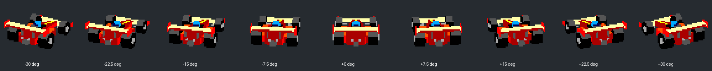
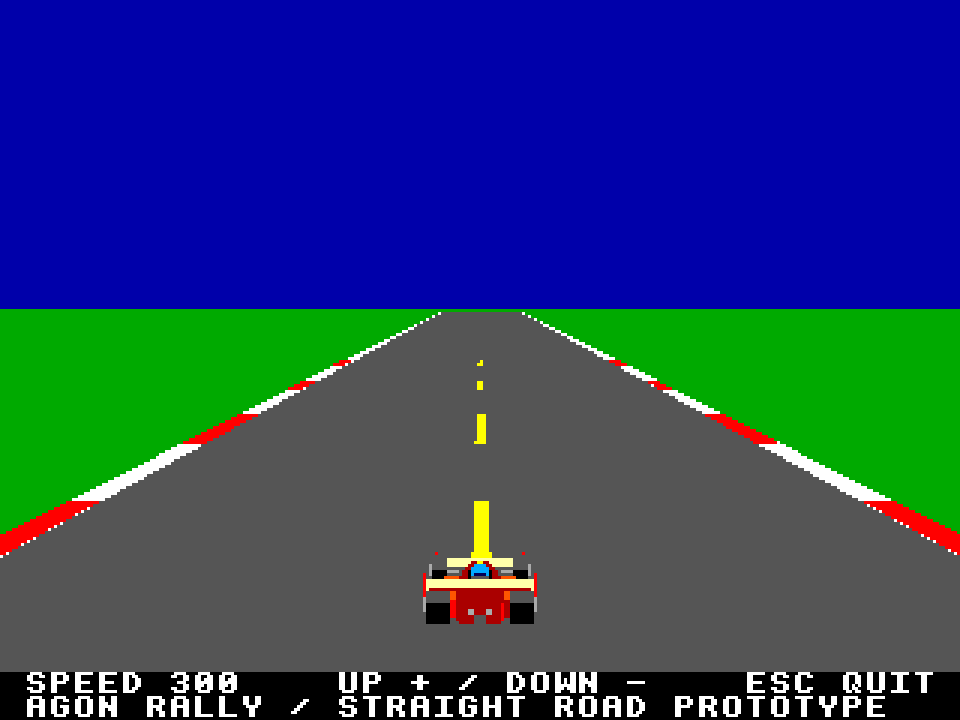

# Rally player car

Original editable low-poly open-wheel racer: red/orange bodywork, cream wings,
black slick tires, metal hubs and a cyan helmet. The current driving prototype embeds these views and selects them in response
to steering.

Open `rally-car.blend` in Blender. Named mesh objects are parented to
`CAR_YAW_ROOT`; +Y is forward, +Z is up. Rotate that root around Z to change yaw.
The fixed orthographic camera preserves framing across every view. Materials
use flat, manually assigned face colors rather than lighting gradients.





## Rebuild from the repository root

```sh
blender -b --threads 2 --python rally/tools/build_car.py
.venv/bin/python rally/tools/export_car.py
```

The builder recreates the model from scratch, overwriting `rally-car.blend`.
Save hand-edited variants under another filename before regenerating. Raw renders
live in ignored `rally/obj/car-raw/`. No image-generation/transformer service is
involved: these are orthographic rasterizations of the same 3D model.

`car-00` through `car-08` cover -30 to +30 degrees in 7.5-degree steps.
Each view is 64x48 pixels with a fixed canvas. PNG and RGBA2222 outputs contain
only channel levels 0,85,170,255 and alpha 0 or 255. The complete set currently
uses 10 opaque RGB colors. The packer enforces the palette, with no dithering.
RGBA2222 bytes use red bits 0-1, green 2-3, blue 4-5 and alpha 6-7, matching
the existing Agon bitmap pipeline. Each bitmap is 3,072 bytes; all nine total
27,648 bytes before upload headers. No view clips against its canvas boundary.

`sprites.json` records angles, opaque bounds, exact palette and byte counts.
The road mockup places the straight sprite at (128,171) on the prior straight
road screenshot; it is a composition preview, not evidence of game integration.
The export also writes `include/car.hpp`. The game preloads all nine views and
uses ordinary bitmap plotting into the back buffer, with one yaw view per persistent steering step.
