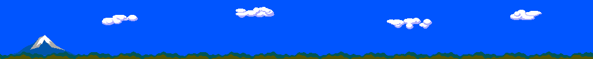

# Distant scenery

A deterministic 1024×103 panorama generated from code: solid blue sky,
procedural clouds, a snow-capped Fuji-like peak, and periodic foothill profiles.
All features are treated as infinitely distant, sharing one absolute track-heading
scroll. Steering and lateral camera offset do not move this layer independently.

`make -C rally scenery` uses the project `.venv`, Pillow and `agonutils` 1.1.0.
The local agon-utils checkout is installed editable into this project's `.venv`:
`uv pip install --python .venv/bin/python -e /home/smith/Agon/mystuff/agon-utils`.
Reference version used: bbe68f5b09451d237a5cc3d2a869b6316fcd649a.
The sky is solid RGB(0,85,255) blue, approximating the reference’s top band. No gradient, noise or dithering.
Clouds, mountain and foothills also use solid palette colours.
Raw gradient work is under ignored `obj/scenery`.

The generator emits PNG, packed 4-bit indices (52,736 bytes), and a C++ header.
Buffered command 72 expands the indices with a 16-byte palette on the VDP.
The resulting opaque bitmap occupies 105,472 bytes; temporary source buffer
63800 is released after expansion. Bitmap 100 uses buffer 64100. Draw one or
two clipped copies to cover the screen across the panorama wrap.

Heading uses a generated integer atan lookup (1024 units/circle), with octant
symmetry and absolute track tangents. No runtime floating point, parallax speeds,
or accumulated scroll drift. A full lap returns to the same panorama bearing.

MoonPatrol was requested as a reference but could not be located in the local
checkout directories or authenticated bgates747 GitHub repository listing. This
artwork was generated independently from the user's supplied visual reference.
