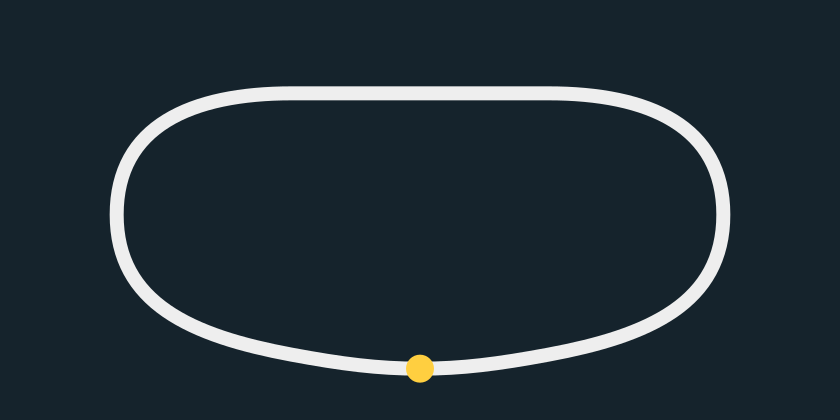
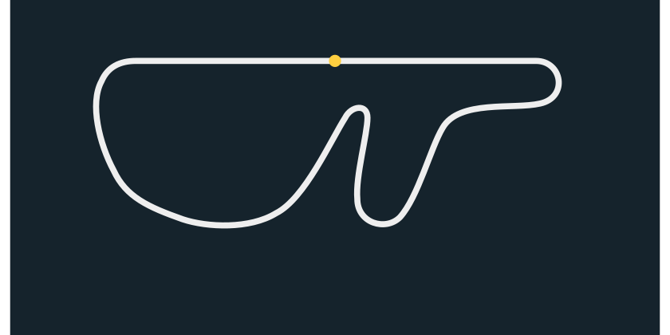

# Selectable flat circuits

## Compact symmetric tri-oval (default)

Approved drawing: matching tighter end turns, a shortened back straight and a
shallow bowed front stretch. The gold start/finish marker is centered on the
front stretch; travel initially toward the right, counterclockwise. No banking.

Playable lap: 5,760 world units (90 samples at 64-unit spacing), approximately
19.2 seconds at a constant 300 units/second. This rounds the 5,753.59-unit
proposal upward by 0.11% to keep the existing table spacing. Analytic minimum
radius is approximately 366.77 units, twice the Fuji cubic minimum of 183.18.
The quantized table gives a sampled minimum of 369.08; Fuji's sampled minimum
is 189.59. Analytical and sampled estimates should not be mixed.

## Preserved Fuji reference

The original arcade-map trace remains unchanged: its geometry CSV is byte-identical
to the previous driving milestone. Length 32,768 units, 512 samples, clockwise
from the gold start marker. No original ROM geometry was used.

JSON files are the authoritative editable cubics. `make -C rally track` generates
both embedded tables, CSVs, simple SVG drawings and sampled-radius summaries.
The default overview at `rally/assets/track.svg` mirrors `tri-oval.svg`.

After loading the same binary, `run` or `run . oval` selects the tri-oval;
`run . fuji` selects Fuji. Append an optional world-distance start for captures.
